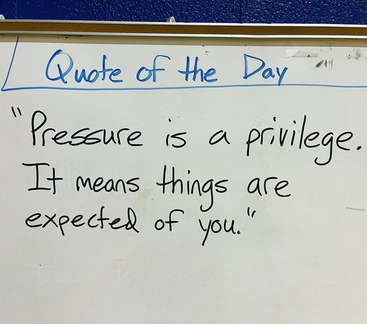

<p align="center">
  
</p>

<p align="center">
  <a href="https://git.io/typing-svg">
    
  </a>
</p>

<p align="center">
  <a href="https://git.io/typing-svg">
    
  </a>
</p>

---

<p align="center">
  
</p>

---

```
$ whoami
```

CS student at NKUA, Athens. I write **C** when I want control, **C++** when I want
power, and **Python** when I want to get home early.

Interested in systems, algorithms, mathematics, and anything low-level enough
to make me question my life choices.

When the math gets heavy I reach for LaTeX,
when the code gets heavy I reach for coffee.

---

### 🔧 stack

<p align="center">
  
</p>

---

### 🔗 find me

<p align="center">
  <a href="https://codeforces.com/profile/evantampa129"></a>
  <a href="https://leetcode.com/u/evantampa129/"></a>
  <a href="https://www.kaggle.com/evantampa129"></a>
</p>

---

### 🔐 ctf

*think you can crack it?*

```
level_0: 666c61677b48656172745f6f665f7468655f436f64657d
level_1: Vm0wd2QyUXlVWGxWV0d4V1YwZDRWMVl3WkRSV01WbDNXa1JTVjFKdGVGWlZNakExVmpBeFdHVkljRmRXTTBKUQ==
level_2: 01010100 01101000 01100101 00100000 01100011 01100001 01101011 01100101 00100000 01101001 01110011 00100000 01100001 00100000 01101100 01101001 01100101
```

<details>
<summary>hint</summary>

`level_0` is hex. `level_1` is wrapped twice. `level_2` is how machines think.

</details>

---

<p align="center">
  
</p>

<p align="center">
  
</p>
